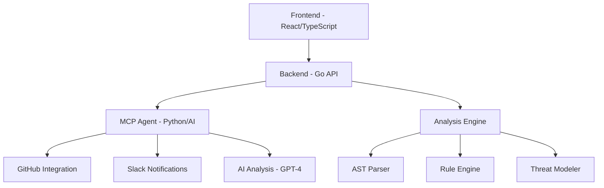

# 🧠 Adaptive Threat Modeler

<div align="center">


**A continuous, AI-powered, context-aware threat modeling tool for modern software development**

[](https://golang.org/)
[](https://reactjs.org/)
[](https://python.org/)
[](LICENSE)

</div>

## 🚀 Overview

Adaptive Threat Modeler is a comprehensive security analysis platform that continuously monitors your codebase for vulnerabilities, generates interactive threat models, and provides AI-powered remediation suggestions. It combines static analysis, dynamic threat modeling, and intelligent automation to help development teams build more secure software.

### ✨ Key Features

- 🔍 **Multi-Language Analysis**: Supports Go, JavaScript, TypeScript, Python, Java, PHP, Ruby, C#, C++, HCL/Terraform, and more
- 🧠 **AI-Powered Intelligence**: GPT-4 integration for enhanced vulnerability analysis and recommendations
- 🎯 **Framework Detection**: Automatic detection of web frameworks, libraries, and infrastructure patterns
- 🌊 **Advanced Analysis Engine**: AST-based parsing, pattern matching, taint analysis, and dataflow tracking
- 🎨 **Interactive Threat Modeling**: Visual threat maps with component relationships and data flows
- ⚡ **Real-Time Processing**: Asynchronous analysis with live status updates and progress tracking
- 🔗 **GitHub Integration**: Direct repository analysis with automated issue creation
- 📊 **Comprehensive Reporting**: Detailed vulnerability reports with CWE/OWASP mappings
- 🔄 **Git Commit Analysis**: Continuous monitoring of code changes and security implications
- 🎪 **Modern UI**: Beautiful, responsive interface with 3D animations and glassmorphism design

## 🏗️ Architecture

The Adaptive Threat Modeler consists of three main components:



### 🔧 Components

| Component | Technology | Purpose |
|-----------|------------|---------|
| **Frontend** | React, TypeScript, Vite, ShadCN UI | Modern web interface with 3D visualizations |
| **Backend** | Go, Fiber, Git integration | Core analysis engine and REST API |
| **MCP Agent** | Python, LangChain, OpenAI | AI-powered analysis and automation |

## 🚀 Quick Start

### Prerequisites

- **Go** 1.23+ (for backend)
- **Node.js** 18+ (for frontend)
- **Python** 3.11+ (for MCP agent)
- **Git** (for repository analysis)


### 🛠️ Manual Setup

#### 1. Backend Setup

```bash
cd backend

# Install dependencies
go mod tidy

# Setup environment
cp env.example .env

# Setup git hooks (optional)
chmod +x scripts/setup-git-hooks.sh
./scripts/setup-git-hooks.sh

# Run the server
go run main.go
```

The backend API will be available at `http://localhost:8080`

#### 2. Frontend Setup

```bash
cd frontend

# Install dependencies
npm install

# Start development server
npm run dev
```

The frontend will be available at `http://localhost:3000`

#### 3. MCP Agent Setup

```bash
cd mcp

# Install dependencies
pip install -r requirements.txt

# Setup GitHub and Slack integration
python setup_github_integration.py

# Configure environment variables
cp .env.example .env
# Edit .env with your API keys and tokens

# Run the agent
python api.py
```

## 📖 Usage

### 🔍 Analyzing a Repository

#### Via Web Interface

1. Open the web interface at `http://localhost:3000`
2. Choose analysis method:
   - **GitHub Repository**: Enter repository URL
   - **File Upload**: Upload a ZIP file
3. Click "Start Analysis" and monitor progress
4. View results with interactive threat maps
5. Access detailed logs with syntax highlighting

#### Via API

```bash
# Analyze GitHub repository
curl -X POST http://localhost:8080/api/v1/analyze/github \
  -H "Content-Type: application/json" \
  -d '{"repo_url": "https://github.com/user/repo", "branch": "main"}'

# Check analysis status
curl http://localhost:8080/api/v1/analysis/{id}/status

# Get results
curl http://localhost:8080/api/v1/analysis/{id}
```

### 🎯 Supported Analysis Types

| Analysis Type | Description | Languages |
|---------------|-------------|-----------|
| **Static Analysis** | AST-based vulnerability detection | All supported languages |
| **Pattern Matching** | Regex and metavariable patterns | All supported languages |
| **Taint Analysis** | Dataflow tracking for security issues | Go, JavaScript, Python |
| **Infrastructure Analysis** | IaC security scanning | Terraform, Docker, Kubernetes |
| **Dependency Analysis** | Third-party library vulnerabilities | All package managers |

### 🔒 Security Rules

The analyzer includes built-in security rules covering:

- **OWASP Top 10** vulnerabilities
- **CWE** (Common Weakness Enumeration) mappings
- **Language-specific** security patterns
- **Framework-specific** vulnerabilities
- **Infrastructure** misconfigurations

#### Example Detections

- SQL Injection (CWE-89)
- Cross-Site Scripting (CWE-79)
- Insecure Cryptography (CWE-327)
- Path Traversal (CWE-22)
- Hardcoded Secrets (CWE-798)
- Publicly Accessible S3 Buckets
- Unencrypted Database Storage

## 🔌 API Reference

### Analysis Endpoints

| Method | Endpoint | Description |
|--------|----------|-------------|
| `POST` | `/api/v1/analyze/github` | Analyze GitHub repository |
| `POST` | `/api/v1/analyze/upload` | Analyze uploaded ZIP file |
| `POST` | `/api/v1/analyze/commit` | Analyze git commit |
| `GET` | `/api/v1/analysis/{id}` | Get analysis results |
| `GET` | `/api/v1/analysis/{id}/status` | Get analysis status |
| `GET` | `/api/v1/analysis/{id}/logs` | Get analysis logs |

### Detection Endpoints

| Method | Endpoint | Description |
|--------|----------|-------------|
| `POST` | `/api/v1/detect/languages` | Detect programming languages |
| `POST` | `/api/v1/detect/frameworks` | Detect frameworks and libraries |

### Rules Endpoints

| Method | Endpoint | Description |
|--------|----------|-------------|
| `GET` | `/api/v1/rules` | Get all available rules |
| `GET` | `/api/v1/rules/{language}` | Get rules for specific language |

### Commit Analysis Endpoints

| Method | Endpoint | Description |
|--------|----------|-------------|
| `GET` | `/api/v1/commits/latest` | Get latest commit analysis |
| `GET` | `/api/v1/commits/{hash}` | Get analysis for specific commit |
| `GET` | `/api/v1/commits` | Get all commit analyses |
| `POST` | `/api/v1/commits` | Store commit analysis |

## 🤖 AI Integration

### MCP Agent Features

The Python MCP agent provides enhanced AI capabilities:

- **GPT-4 Analysis**: Deep semantic understanding of security issues
- **Automated Issue Creation**: GitHub issues with detailed remediation steps
- **Slack Integration**: Real-time notifications with action buttons
- **Multi-Agent System**: Specialized agents for different security domains

### GitHub Integration

Automatically creates GitHub issues with:

- **Structured Format**: Well-organized vulnerability reports
- **Severity Levels**: Critical, High, Medium, Low classifications
- **Actionable Recommendations**: Specific remediation steps
- **Code Examples**: Secure coding patterns and fixes

### Slack Notifications

Enhanced Slack messages include:

- **Severity Summary**: Visual breakdown of vulnerability counts
- **Action Buttons**: Direct links to GitHub issues and reports
- **Real-time Updates**: Immediate notifications on security findings

## 🎨 Frontend Features

### Modern Interface

- **3D Brain Animation**: Engaging visual representation
- **Particle Effects**: Dynamic background animations
- **Glassmorphism Design**: Modern, translucent UI elements
- **Responsive Layout**: Optimized for all screen sizes

### Interactive Components

- **Threat Maps**: Visual representation of application architecture
- **Real-time Progress**: Live updates during analysis
- **Syntax-highlighted Logs**: Color-coded analysis output
- **Drag & Drop Upload**: Intuitive file upload interface

### Advanced Visualizations

- **Component Relationships**: Interactive network diagrams
- **Data Flow Tracking**: Visual representation of information flow
- **Risk Heatmaps**: Color-coded severity indicators
- **Timeline Views**: Historical analysis tracking

## 🔧 Configuration

### Backend Configuration

Create `backend/.env` file:

```env
# Server Configuration
PORT=8080
HOST=localhost

# Git Configuration
GIT_TIMEOUT=300

# Analysis Configuration
MAX_FILE_SIZE=100MB
ANALYSIS_TIMEOUT=600
```

### Frontend Configuration

Configure in `frontend/vite.config.ts`:

```typescript
export default defineConfig({
  server: {
    port: 3000,
    proxy: {
      '/api': 'http://localhost:8080'
    }
  }
})
```

### MCP Agent Configuration

Create `mcp/.env` file:

```env
# GitHub Integration
GITHUB_TOKEN=ghp_your_token_here
GITHUB_OWNER=your_username
GITHUB_REPO=your_repository

# Slack Integration
SLACK_WEBHOOK_URL=https://hooks.slack.com/services/YOUR/SLACK/WEBHOOK

# OpenAI Configuration
OPENAI_API_KEY=your_openai_api_key_here

# API Configuration
BACKEND_API_URL=http://localhost:8080
```

## 🐛 Troubleshooting

### Common Issues

#### Backend Issues

**Port already in use:**
```bash
# Find and kill process using port 8080
lsof -ti:8080 | xargs kill -9
```

**Git clone failures:**
```bash
# Check git configuration
git config --list
# Ensure proper authentication for private repositories
```

#### Frontend Issues

**Dependencies installation failed:**
```bash
# Clear npm cache and reinstall
npm cache clean --force
rm -rf node_modules package-lock.json
npm install
```

**Build failures:**
```bash
# Check TypeScript configuration
npx tsc --noEmit
```

#### MCP Agent Issues

**OpenAI API errors:**
- Verify API key is valid and has sufficient credits
- Check rate limiting and quota usage

**GitHub integration issues:**
- Ensure token has `repo` scope permissions
- Verify repository access and organization settings

**Slack webhook failures:**
- Test webhook URL manually
- Check Slack app configuration and permissions

### Debug Mode

Enable detailed logging:

```bash
# Backend debug mode
export DEBUG=true
export LOG_LEVEL=debug

# Frontend debug mode
export VITE_DEBUG=true

# MCP agent debug mode
export DEBUG=true
export LOG_LEVEL=DEBUG
```


## 🤝 Contributing

We welcome contributions! Please follow these guidelines:

### Development Setup

1. **Fork the repository**
2. **Create a feature branch**
   ```bash
   git checkout -b feature/amazing-feature
   ```
3. **Install dependencies for all components**
   ```bash
   # Backend
   cd backend && go mod tidy
   
   # Frontend
   cd frontend && npm install
   
   # MCP Agent
   cd mcp && pip install -r requirements.txt
   ```


### Testing

```bash
# Backend tests
cd backend && go test ./...

# Frontend tests
cd frontend && npm test

# MCP agent tests
cd mcp && python -m pytest
```

### Pull Request Process

1. **Update documentation** for any new features
2. **Add tests** for new functionality
3. **Ensure CI passes** all checks
4. **Request review** from maintainers

## 📚 Documentation

### Component Documentation

- [Backend API Documentation](backend/README.md)
- [Frontend Development Guide](frontend/README.md)
- [MCP Agent Integration](mcp/README.md)
- [Logs Feature Documentation](LOGS_FEATURE.md)

### Additional Resources

- [Security Rules Reference](docs/SECURITY_RULES.md)
- [API Examples](docs/API_EXAMPLES.md)

## 🔒 Security

### Reporting Security Issues

Please report security vulnerabilities to: security@adaptive-threat-modeler.com

Do not open public GitHub issues for security vulnerabilities.

### Security Best Practices

- Keep dependencies updated
- Use environment variables for sensitive data
- Enable HTTPS in production
- Implement proper authentication and authorization
- Regular security audits and penetration testing

## 📝 License

This project is licensed under the MIT License - see the [LICENSE](LICENSE) file for details.

## 🙏 Acknowledgments

- **OWASP** for security standards and guidelines
- **CWE** for vulnerability classification
- **Semgrep** for static analysis patterns
- **Open Source Community** for tools and libraries

## 📞 Support

- 📧 **Email**: support@adaptive-threat-modeler.com
- 💬 **Discord**: [Join our community](https://discord.gg/adaptive-threat-modeler)
- 📖 **Documentation**: [docs.adaptive-threat-modeler.com](https://docs.adaptive-threat-modeler.com)
- 🐛 **Issues**: [GitHub Issues](https://github.com/Denyme24/Adaptive-Threat-Modeler/issues)

---

<div align="center">

**Built with ❤️ by the Adaptive Threat Modeler Team**

[Website](https://adaptive-threat-modeler.com) • [Documentation](https://docs.adaptive-threat-modeler.com) • [Community](https://discord.gg/adaptive-threat-modeler)

</div>